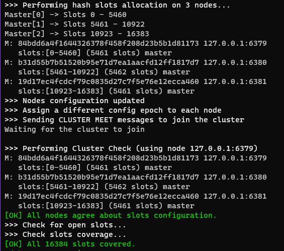

# redisearch-cluster-issue
This repo is used as a tool to simplify communication on an issue about Redisearch.

### Problem

When using Redisearch in combination with Redis Cluster, the indexing doesn't return all the values expected. Some are missing.


### Tools needed
 - Git
 - Docker
 - Redis-CLI depending on which test you run
 - NodeJS ( Optional )

### **To Reproduce**
Clone this repo.
```bash
$ git clone https://github.com/odubuc/redisearch-cluster-issue.git && cd redisearch-cluster-issue
```

Note: net:host is used to remove any NATing or networking related issues.

```yaml
version: "3.8"

services:
    instance1:
        image: redis/redis-stack-server:latest
        container_name: redis-instance1
        network_mode: host
        environment:
            - REDIS_ARGS=--cluster-enabled yes --port 6379
    instance2:
        container_name: redis-instance2
        image: redis/redis-stack-server:latest
        network_mode: host
        environment:
            - REDIS_ARGS=--cluster-enabled yes --port 6380
    instance3:
        container_name: redis-instance3
        image: redis/redis-stack-server:latest
        network_mode: host
        environment:
            - REDIS_ARGS=--cluster-enabled yes --port 6381
```

Deploy the compose file
```bash
$ sudo docker compose -f compose.yaml up
```


In a second terminal, create the cluster with the previously created containers
```bash
$ redis-cli -h 127.0.0.1 -p 6379 --cluster create 127.0.0.1:6379 127.0.0.1:6380 127.0.0.1:6381 --cluster-yes --cluster-replicas 0
```

This will give you a sucessfull cluster creation with 3 master no replica


Once done, you can use either this NodeJS code or the RediSeatch doc example.

### Using NodeJS and the code of this repo
Install the dependencies
```bash
npm ci
```

run the program
```
npm start
```

The program is very simple. 
1. An index is created
2. 8 JSON document are added to Redis
3. ft.search is used on the cluster. 4 documents should be returned (it won't. thats the issue)

### Using RediSearch own Exmple

The example can be viewed [here](https://redis.com/blog/getting-started-with-redisearch-2-0) or followed bellow : 

Steps: 

1. connect to the cluster using redis-cli in cluster mode ( -c )
```bash
redis-cli -h 127.0.0.1 -p 6379 -c
```

2. Insert Data
```bash
> HSET movie:11002 title "Star Wars: Episode V - The Empire Strikes Back" plot "Luke Skywalker begins Jedi training with Yoda." release_year 1980 genre "Action" rating 8.7 votes 1127635

(integer) 6 

> HSET movie:11003 title "The Godfather" plot "The aging patriarch of an organized crime dynasty transfers control of his empire to his son." release_year 1972 genre "Drama" rating 9.2 votes 1563839 

(integer) 6
```

3. Create the index
```bash
> FT.CREATE idx:movie ON hash PREFIX 1 "movie:" SCHEMA title TEXT SORTABLE release_year NUMERIC SORTABLE rating NUMERIC SORTABLE genre TAG SORTABLE

OK
```

4. Use FT.SEARCH
```bash
FT.SEARCH idx:movie "war" RETURN 3 title release_year rating
```

At this point there's a chance you see 0 or 1 document. You should see 2.

